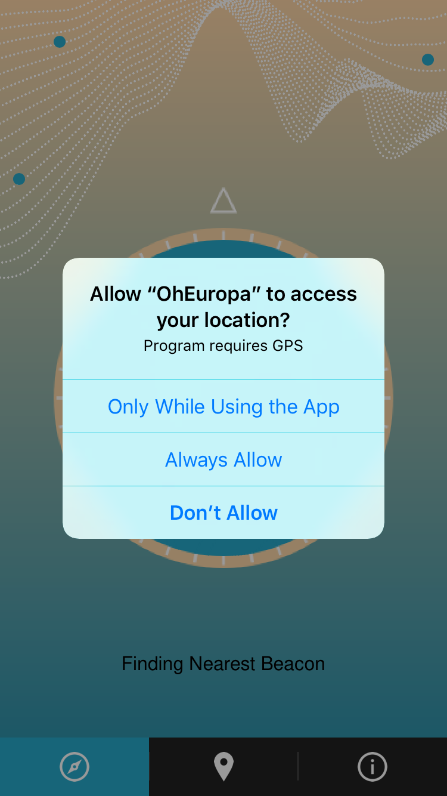
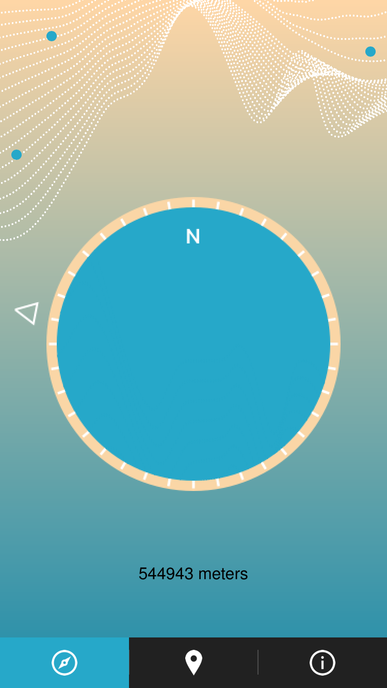
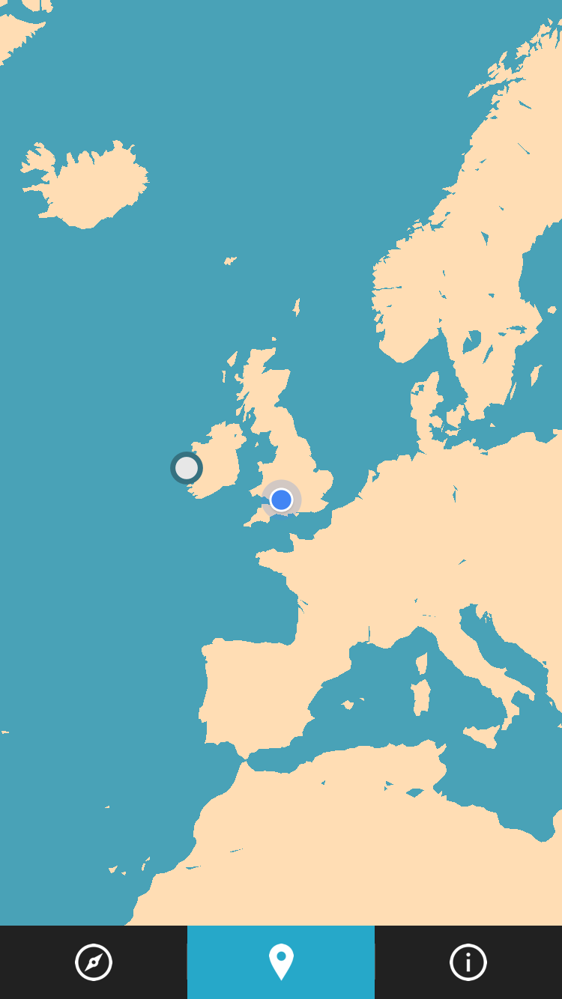
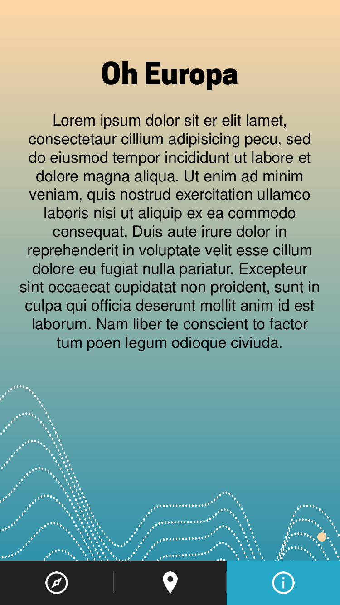

## Oh Europa 

### Overview

Oh Europa is an iOS application which checks the users current location against a list of defined beacons. If the User is inside one of the beacon zones the application begins to stream live audio to the device.

### Files

* AppDelegate.swift

##### Controllers 

| File | Purpose |
| --- | --- |
| OEAudioController.swift | Controls the live stream of audio and the cross fading. |
| OECompass.swift | Is responsible for the Compass View, so the rendering of the compass direction and the marker as well as the animations of the view. |
| OEHTTPController.swift | Controls the POST and GET requests to and from the Server. |
| OEGetBeacons.swift | Does the GET from the Server and handles local storage. |

##### Models

| File | Purpose |
| --- | --- |
| OEMapBeacon.swift | Storage for data. Also handles it own distance calculations. |

##### View Controllers 

| File | Purpose |
| --- | --- |
| OETabBarViewController.swift | Handles the Custom Tab Bar Controller |
| OECustomTabBar.swift | Creates the TaBar |
| OECustomTabBarItem.swift | Custom Tab Bar Item Object |
| OEMapViewController.swift | Handles the Map View |
| OECompassViewController.swift | Handles the Compass and controls the audio and geolocation |
| OEInformationViewController.swift | Information Handler |
| OEIntroViewController.swift | Handles the intro view controller |

### Requirements

The application uses the following additional libraries:

* [Reachability](https://github.com/ashleymills/Reachability.swift)
* [Google Maps](https://developers.google.com/maps/documentation/ios-sdk/code-samples)
* [SwiftyJSON](https://github.com/SwiftyJSON/SwiftyJSON)
* [Alamofire](https://github.com/Alamofire/Alamofire)
* [Streaming Kit](https://github.com/tumtumtum/StreamingKit)
* [Tween Kit](https://github.com/SteveBarnegren/TweenKit)
* [Processing Kit](https://github.com/natmark/ProcessingKit)
* [Font Awesome](https://github.com/thii/FontAwesome.swift)
* [Sync](https://github.com/3lvis/Sync)

### Screens

**Intro Screen**

**Permissions Screen**

**Compass Screen**

**Map Screen**

**Information Screen**

### Thanks

* [Adam Bardon](http://http://blog.adambardon.com/how-to-create-custom-tab-bar-in-swift-part-1/) for the tutorial on how to create custom UITabBars.
