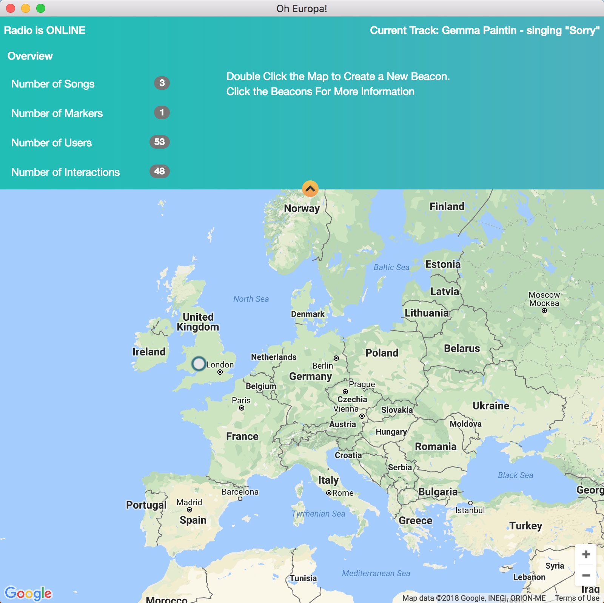
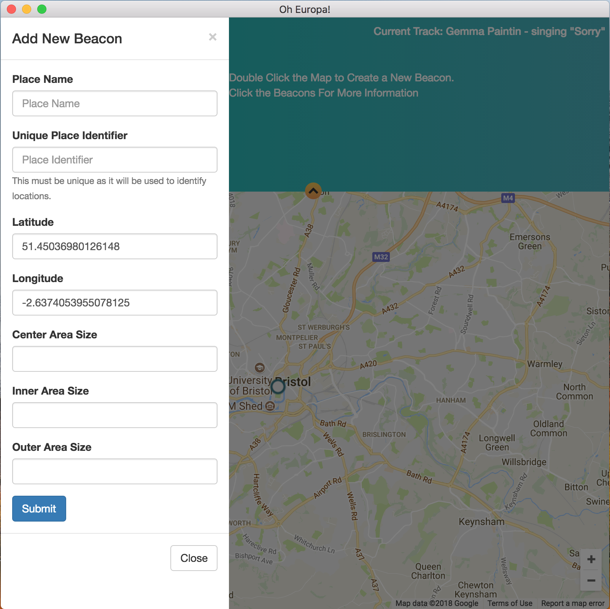
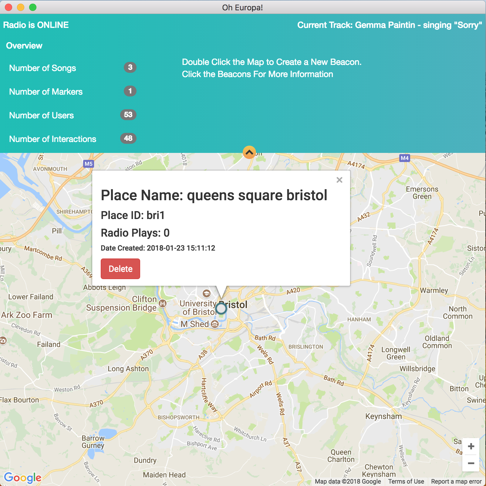

## Oh Europa Client

### Overview

The Client is a Node JS application which enables the users to generate new or remove beacons from the server without having to handle databases or deal with online forms. They simply double click the map and a fill in a small form and the beacon with be propigated into the system.

### Files 

* index.html
* index.js
* main.js
* mapmanager.html
* sidebar.html
* package.json
* js/schmodaljs

### How it works

The app generates a google map with data from the server relating to places and an overview of the current activity.

When the user double clicks the map a modal window appears and ask the user to input details about the proposed beacon. 

After clicking submit the data is sent to the server.  

And a beacon is represented on the map itself.

### Requirements
The requirements and stored in the package.json file. But for reference:

* bootstrap
* bootstrap-beta
* electron-fetch
* font-awesome
* gmaps
* jquery
* tooltip.js
 
### How to Build

For a standalone application in terminal run the following commands.

```
cd <pathofclient>
electron-packager . OhEuropa darwin
```

### Screens

**Main Application Window**



**Add Beacon**



**Remove Beacon**



### Thanks